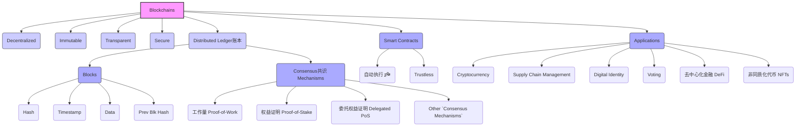
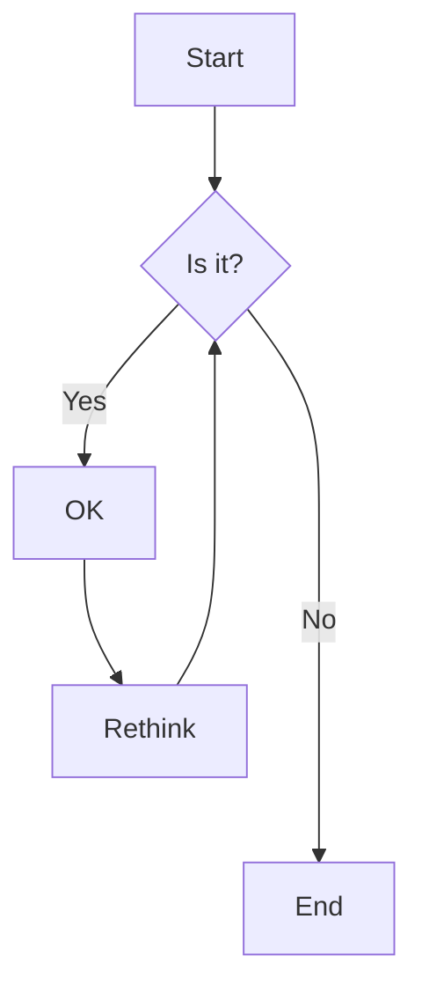
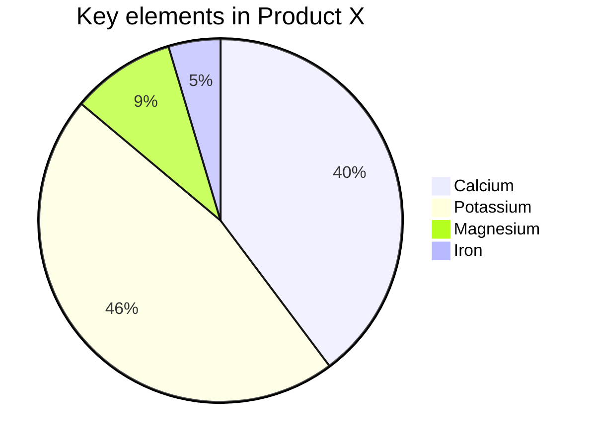
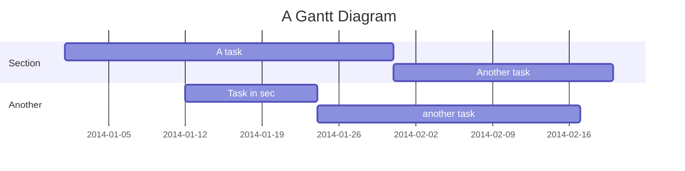
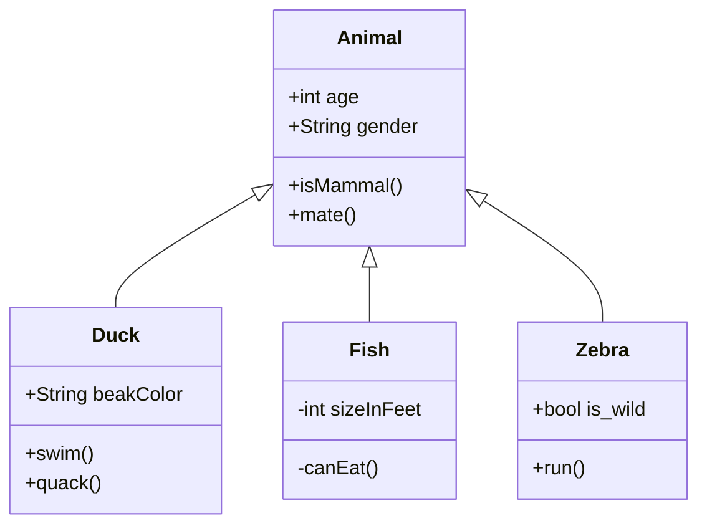
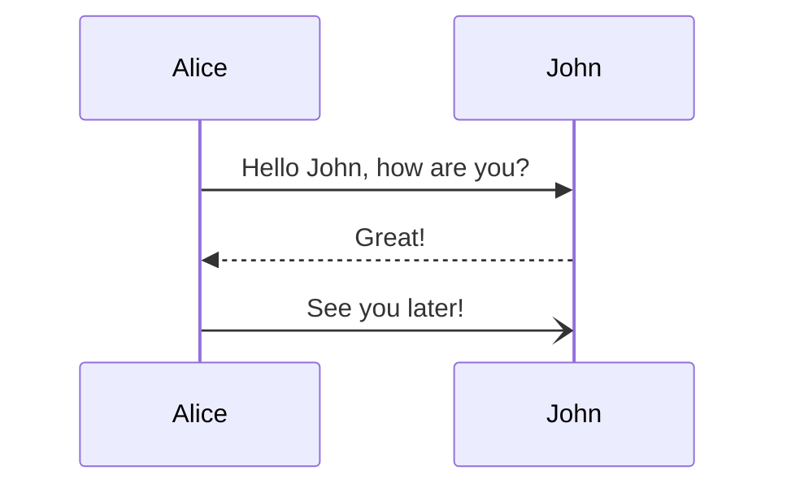
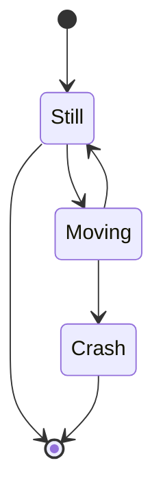
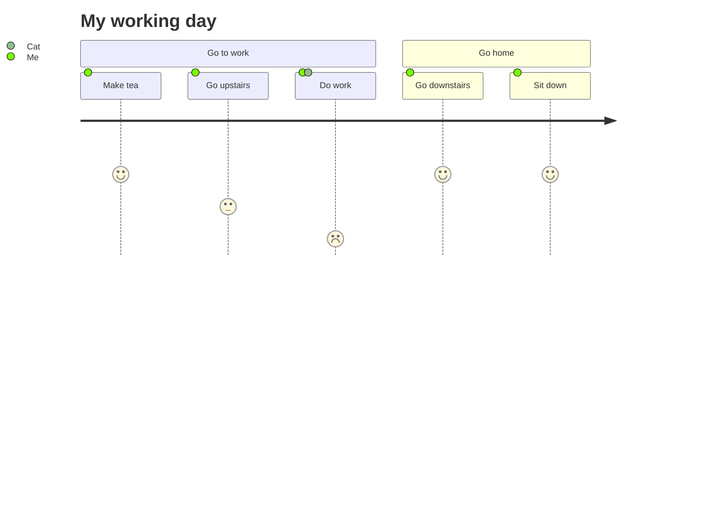
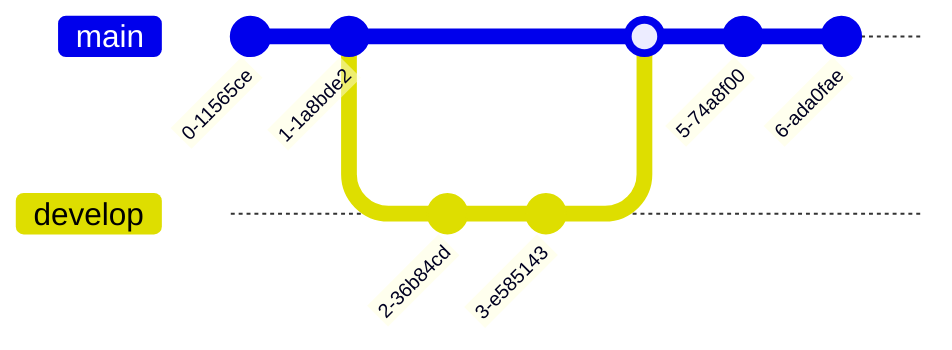
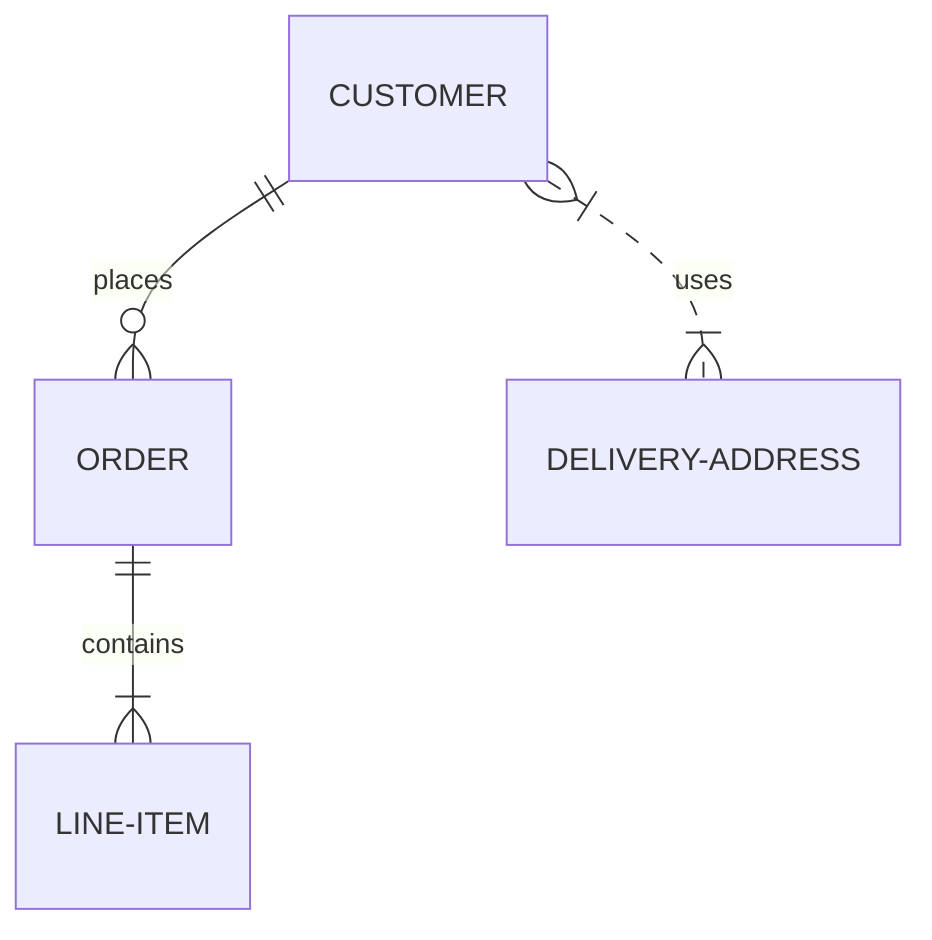

```mermaid
graph TD
    A[Blockchains] --> B(Decentralized);
    A --> C(Immutable);
    A --> D(Transparent);
    A --> E(Secure);
    A --> F(Distributed Ledger账本);
    F --> G(Blocks);
    G --> H(Hash);
    G --> I(Timestamp);
    G --> J(Data);
    G --> K(Prev Blk Hash);
    F --> L(Consensus共识 Mechanisms);
    L --> M(工作量 Proof-of-Work);
    L --> N(权益证明 Proof-of-Stake);
    L --> O(委托权益证明 Delegated PoS);
    L --> P(Other `Consensus Mechanisms`);
    A --> Q(Smart Contracts);
    Q --> R(自动执行 চুক্তি);
    Q --> S(Trustless);
    A --> T(Applications);
    T --> U(Cryptocurrency);
    T --> V(Supply Chain Management);
    T --> W(Digital Identity);
    T --> X(Voting);
    T --> Y(去中心化金融 DeFi);
    T --> Z(非同质化代币 NFTs);

    style A fill:#f9f,stroke:#333,stroke-width:2px
    style B fill:#ccf,stroke:#333,stroke-width:1px
    style C fill:#ccf,stroke:#333,stroke-width:1px
    style D fill:#ccf,stroke:#333,stroke-width:1px
    style E fill:#ccf,stroke:#333,stroke-width:1px
    style F fill:#ccf,stroke:#333,stroke-width:1px
    style G fill:#aaf,stroke:#333,stroke-width:1px
    style L fill:#aaf,stroke:#333,stroke-width:1px
    style Q fill:#aaf,stroke:#333,stroke-width:1px
    style T fill:#aaf,stroke:#333,stroke-width:1px
```

## Mermaid
## Graph

```mermaid
graph TD
    A[Start] --> B{Is it?}
    B -- Yes --> C[OK]
    C --> D[Rethink]
    D --> B
    B -- No ----> E[End]
```
## Pie

```mermaid
pie
    title Key elements in Product X
    "Calcium" : 42.96
    "Potassium" : 50.05
    "Magnesium" : 10.01
    "Iron" :  5
```
## Gantt

```mermaid
gantt
    title A Gantt Diagram
    dateFormat  YYYY-MM-DD
    section Section
    A task           :a1, 2014-01-01, 30d
    Another task     :after a1  , 20d
    section Another
    Task in sec      :2014-01-12  , 12d
    another task      : 24d
```

```mermaid
classDiagram
    Animal <|-- Duck
    Animal <|-- Fish
    Animal <|-- Zebra
    Animal : +int age
    Animal : +String gender
    Animal: +isMammal()
    Animal: +mate()
    class Duck{
      +String beakColor
      +swim()
      +quack()
    }
    class Fish{
      -int sizeInFeet
      -canEat()
    }
    class Zebra{
      +bool is_wild
      +run()
    }
```

## Sequence Diagram

```mermaid
sequenceDiagram
    Alice->>John: Hello John, how are you?
    John-->>Alice: Great!
    Alice-)John: See you later!
```
## State

```mermaid
stateDiagram
    [*] --> Still
    Still --> [*]
    Still --> Moving
    Moving --> Still
    Moving --> Crash
    Crash --> [*]
```

## Journey

```mermaid
journey
    title My working day
    section Go to work
      Make tea: 5: Me
      Go upstairs: 3: Me
      Do work: 1: Me, Cat
    section Go home
      Go downstairs: 5: Me
      Sit down: 5: Me
```
## Git

```mermaid
gitGraph
    commit
    commit
    branch develop
    checkout develop
    commit
    commit
    checkout main
    merge develop
    commit
    commit
```

## **Entity Relationship Diagram - ER Diagram**

```mermaid
erDiagram
    CUSTOMER ||--o{ ORDER : places
    ORDER ||--|{ LINE-ITEM : contains
    CUSTOMER }|..|{ DELIVERY-ADDRESS : uses
```
