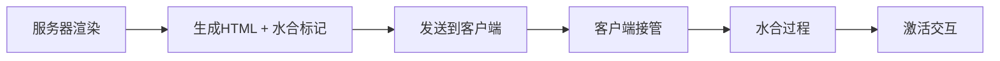

Svelte 的服务器端渲染（SSR）和水合（Hydration）机制。让我们深入分析：
# 水和过程

## 1. **服务器端编译代码**
```js
import * as $ from 'svelte/internal/server';
export default function Main($$payload) {
    let foo = undefined;
    // 注意这里的 foo 只是普通变量，不是响应式状态
    $$payload.out += `<button>${$.escape(foo)}</button>`; // 直接生成 HTML 字符串
}
```
## 2 生成
```html
<!--[--><button></button><!--]-->
```
这些注释 `<!--[-->` 和 `<!--]-->` 是 **hydration markers**（水合标记），它们有特殊的用途。
让我们看看相关的实现代码：
```js
import { HYDRATION_END, HYDRATION_START, HYDRATION_START_ELSE } from '../../constants.js';
export const BLOCK_OPEN = `<!--${HYDRATION_START}-->`; // --[--
export const BLOCK_OPEN_ELSE = `<!--${HYDRATION_START_ELSE}-->`; // --[!--
export const BLOCK_CLOSE = `<!--${HYDRATION_END}-->`; // --]--
export const EMPTY_COMMENT = `<!---->`;
```
### 标记作用
这些注释标记的作用是：
1. **标记动态区域**
- `<!--[-->` 和 `<!--]-->` 标记了可能需要动态更新的区域
- 这些标记帮助客户端代码识别需要"水合"的部分
2. 水合过程
```js
// 服务器端渲染时
let foo = undefined;  // 静态值
// 客户端水合时
let foo = $.state(undefined);  // 变成响应式状态
``` 
3. 工作流程

- **服务器端**：    
    - 生成静态 HTML
    - 插入水合标记
    - 标记动态内容区域
- **客户端**：    
    - 识别水合标记
    - 重建响应式状态
    - 添加事件监听器
    - 激活交互功能
###  **为什么需要这些标记？**

- **精确定位**：帮助客户端代码准确找到需要处理的 DOM 部分
- **状态恢复**：帮助重建组件的响应式状态
- **性能优化**：避免不必要的 DOM 重建
- **渐进式增强**：允许在 JavaScript 加载前显示内容

**实际效果**：
```html
<!-- 初始 HTML（服务器渲染） -->
<!--[--><button></button><!--]-->
<!-- JavaScript 加载后 -->
<button><!-- 现在可以响应点击事件并更新文本 --></button>
```

这种设计的优点：

1. **性能优化**
    - 快速的首次页面加载
    - 最小化客户端 JavaScript
    - 渐进式激活
2. **SEO 友好**
    - 搜索引擎可以看到完整内容
    - 不依赖 JavaScript 的初始渲染
3. **用户体验**
    - 快速的首屏显示
    - 平滑的交互激活
    - 无闪烁更新
4. **开发体验**
    - 统一的编程模型
    - 自动的状态管理
    - 简化的服务器/客户端协调
这就是为什么看似简单的代码背后有这么多"魔法"的原因。这些魔法实际上是精心设计的同构渲染系统的一部分，使得 Svelte 能够提供出色的开发体验和运行时性能。

# 策略
让我来对比不同框架的水合（Hydration）策略：

## **Svelte 的渐进式激活**

`<!--[--> <button>Click me</button> <!--]-->`

- 使用注释标记可水合区域
- 按需激活组件
- 保持 DOM 结构，只添加交互性

## **Qwik 的恢复式水合**

`<button on:click="./chunks/click.js#handler" q:id="xyz">   Click me </button>`
- 零水合（No Hydration）策略
- 使用 URL 标记事件处理器
- 延迟加载（Lazy Loading）所有交互
- 序列化状态到 HTML
```js
// chunks/click.js 
export const handler = () => {   // 只有在点击时才加载这段代码
```

## **SolidJS Start 的选择性水合**
```tsx
// 使用 Island 架构
<Suspense>
  <Island>
    <InteractiveComponent />
  </Island>
</Suspense>
```

- 基于 Islands 架构
- 细粒度的资源加载
- 选择性组件激活
- 流式 SSR

## **Next.js 的完全水合**
```tsx
'use client'
// 需要显式标记客户端组件
export default function ClientComponent() {
  // 整个组件树都会被水合
}
```
 
- RSC（React Server Components）
- 客户端/服务器组件分离
- 完整的组件树水合
- 服务器优先渲染

## **Astro 的孤岛架构**

```js
---
// 只有需要交互的组件才会被水合
---
<ReactCounter client:visible />
<SvelteCounter client:idle />
<VueCounter client:load />
```

- 零 JavaScript 默认
- 显式的客户端指令
- 混合框架支持
- 按需水合策略

## **Fresh (Deno) 的孤岛+部分水合**
```tsx
import { IS_BROWSER } from "$fresh/runtime.ts";
export default function Counter() {
  if (IS_BROWSER) {
    // 只在浏览器中执行的代码
  }
}
```
- 预编译的孤岛
- 无构建步骤
- 部分水合
- 服务器优先

各种方案的比较：

| 框架            | 水合策略    | 优点                            | 缺点                 |     |
| ------------- | ------- | ----------------------------- | ------------------ | --- |
| Svelte        | 渐进式激活   | - 平滑过渡  - 细粒度控制  - 性能好        | - 需要特殊标记 - 状态管理复杂  |     |
| Qwik          | 恢复式水合   | - 极小的初始 JS  - 按需加载  - SEO 友好  | - 构建复杂  - 学习曲线陡    |     |
| SolidJS Start | 选择性水合   | - 灵活  - 性能好  - 开发体验好          | - 需要手动优化 - 配置复杂    |     |
| Next.js       | 完全水合    | - 开发体验好  - 生态系统大  - 工具支持好     | - 初始加载重  - 资源消耗大   |     |
| Astro         | 孤岛架构    | - 零 JS 默认  - 多框架支持  - SEO 友好  | - 组件间通信复杂  - 状态共享难 |     |
| Fresh         | 孤岛+部分水合 | - ***无构建要求***  - 快速启动  - 简单直接 | - 生态较小  - 限制较多     |     |

未来趋势：

1. **细粒度控制**

- 更精确的资源加载
- 更智能的代码分割
- 更好的缓存策略

1. **混合方案**

- 组合多种水合策略
- 适应不同场景需求
- 平衡性能和开发体验

1. **编译优化**

- 更智能的静态分析
- 更好的代码生成
- 更小的运行时开销

1. **开发体验**

- 更简单的 API
- 更好的调试工具
- 更直观的性能优化

每种方案都有其适用场景，选择时需要考虑：

1. 应用的交互复杂度
2. 性能要求
3. SEO 需求
4. 开发团队熟悉度
5. 部署环境限制

这个领域还在快速发展，新的解决方案不断涌现，但核心目标都是在性能和开发体验之间找到最佳平衡点。