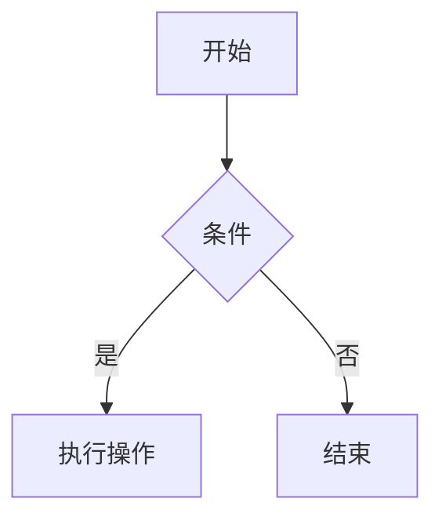
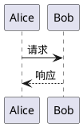

### **Python 图像显示库的脑图**

#### **1. 核心库**

- **Matplotlib**
	- **特点**：Python 中最常用的 2D 绘图库，功能强大，支持多种图表类型。
	- **用途**：科学计算、数据分析、学术绘图。
	- **后端**：
		- **Tkinter**：默认后端，适合简单的 GUI 显示。
		- **Qt5**：功能更强大，适合复杂的交互式应用。
		- **WX**：跨平台 GUI 库，支持高级功能。
		- **Agg**：非交互式后端，用于生成图像文件。
		- `TkAgg`：基于 Tkinter 的后端，适合简单的桌面应用。
		- `Qt5Agg`：基于 PyQt/PySide 的后端，功能强大，适合复杂的交互式应用。
		- `WXAgg`：基于 WXPython 的后端，跨平台支持。
     **使用场景**：本地开发、桌面应用、交互式数据分析。
#### **2. 高级绘图库**

- **Seaborn**
	- **特点**：基于 Matplotlib 的高级接口，专注于统计绘图。	
	- **用途**：数据可视化、统计分析。
- **Plotly**
	- **特点**：交互式图表库，支持动态和 3D 绘图。	
	- **用途**：Web 应用、交互式仪表盘。
- **Bokeh**
	- **特点**：专注于 Web 交互式可视化。	
	- **用途**：实时数据可视化、Web 应用。

#### **3. GUI 框架**

- **Tkinter**

- **特点**：Python 标准 GUI 库，简单易用。

- **用途**：小型桌面应用、简单的图形界面。

- **PyQt/PySide**

- **特点**：基于 Qt 框架的 GUI 库，功能强大。

- **用途**：复杂的桌面应用、跨平台开发。

- **WXPython**

- **特点**：基于 WXWidgets 的 GUI 库，跨平台支持。

- **用途**：桌面应用开发。


#### **4. 图像处理库**

- **Pillow**

- **特点**：Python 图像处理库，支持多种图像格式。

- **用途**：图像编辑、格式转换。

- **OpenCV**

- **特点**：计算机视觉库，支持图像和视频处理。

- **用途**：图像识别、视频分析。


#### **5. Web 可视化库**

- **Dash**

- **特点**：基于 Flask 和 Plotly 的 Web 应用框架。

- **用途**：构建交互式 Web 仪表盘。

- **Altair**

- **特点**：基于 Vega 和 Vega-Lite 的声明式可视化库。

- **用途**：快速创建统计图表。


#### **6. 3D 绘图库**

- **Mayavi**

- **特点**：专注于科学数据的 3D 可视化。

- **用途**：3D 数据可视化、科学计算。

- **Plotly 3D**

- **特点**：Plotly 的 3D 绘图扩展。

- **用途**：交互式 3D 图表。


#### **7. 其他工具**

- **IPython/Jupyter**

- **特点**：交互式计算环境，支持内嵌图表显示。

- **用途**：数据分析、教学、原型开发。

- **Pandas 绘图**

- **特点**：Pandas 内置的简单绘图功能。

- **用途**：快速数据探索。


```tikz
\begin{document}
\begin{tikzpicture}
    \draw[->] (-2,0) -- (2,0) node[right]{$x$};
    \draw[->] (0,-2) -- (0,2) node[above]{$y$};
    \draw[domain=-1.5:1.5, smooth, variable=\x, blue] plot ({\x}, {\x*\x});
\end{tikzpicture}
\end{document}
```


```tikz
\begin{document}
  \begin{tikzpicture}[domain=0:4]
    \draw[very thin,color=gray] (-0.1,-1.1) grid (3.9,3.9);
    \draw[->] (-0.2,0) -- (4.2,0) node[right] {$x$};
    \draw[->] (0,-1.2) -- (0,4.2) node[above] {$f(x)$};
    \draw[color=red]  plot (\x,\x)             node[right] {$f(x) =x$};
    \draw[color=blue] plot (\x,{sin(\x r)})    node[right] {$f(x) = \sin x$};
    \draw[color=cyan] plot (\x,{0.05*exp(\x)}) node[right] {$f(x) = \mathrm e^x$};
  \end{tikzpicture}
\end{document}
```

```tikz
\begin{document}
  \begin{tikzpicture}[domain=0:4]
    \draw[very thin,color=gray] (-0.1,-1.1) grid (3.9,3.8);
    \draw[->] (-0.5,0) -- (4.2,0) node[right] {$x$};
    \draw[->] (0,-1.2) -- (0,4.2) node[above] {$f(x)$};
    \draw[color=red]   plot (\x,\x)             node[right] {$f(x) =x$};
    \draw[color=green] plot (\x,{sin(\x r)})    node[right] {$f(x) = \sin x$};
    \draw[color=cyan]  plot (\x,{0.05*exp(\x)}) node[right] {$f(x) = \mathrm e^x$};
  \end{tikzpicture}
\end{document}
```

```tikz
\begin{document}
  \begin{tikzpicture}[domain=0:4]
    \draw[very thin,color=gray] (-0.1,-1.1) grid (3.9,3.8);
    \draw[->] (-0.5,0) -- (4.2,0) node[right] {$x$};
    \draw[->] (0,-1.2) -- (0,4.2) node[above] {$f(x)$};
    \draw[color=red] plot (\x,{2*pi)^-.5*exp(-1/2*\x^2)}) node[right] {$PDF(x) =x$};
  \end{tikzpicture}
\end{document}
```

$\pi$

  
${\displaystyle f(x)={\frac {1}{\sqrt {2\pi }}}\,\exp \left(-{\frac {x^{2}}{2}}\right)}$

${\displaystyle f(x)={\frac {1}{\sqrt {2\pi }}}\,\exp \left(-{\frac {x^{2}}{2}}\right)}$




```latex
\begin{tikzpicture}
    \draw[->] (-2,0) -- (2,0) node[right]{$x$};
    \draw[->] (0,-2) -- (0,2) node[above]{$y$};
    \draw[domain=-1.5:1.5, smooth, variable=\x, blue] plot ({\x}, {\x*\x});
\end{tikzpicture}
```

