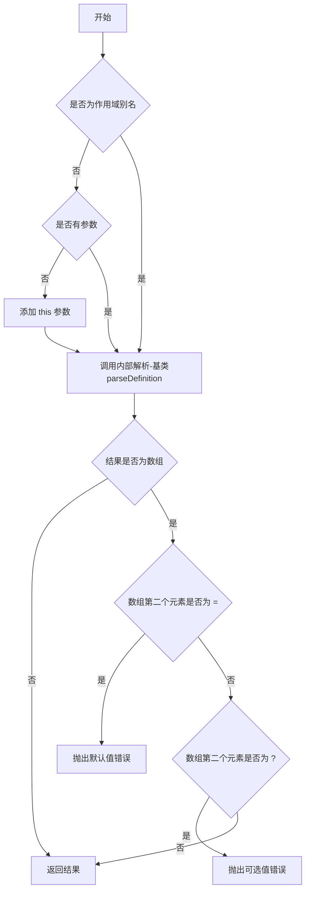
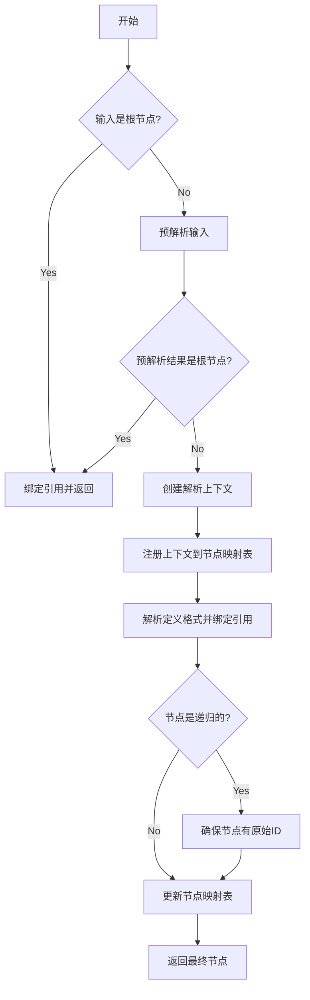

> @scope.ts 这个2个文件是 github 上aketype.io/aketype仓库的核心, 请解释其中的概念和作用, 如 BaseScope, InteralScope, SchemaScope, scope, module, type, 以及它们之间的关系. 注意scope除了是 InteralScope的静态属性(类型ScopeParser, 一个函数用于构造InteralScope), 还是命名空间. type则是scope函数副产品

我来分析这两个关键文件的核心概念和它们之间的关系:

1. BaseScope: 基础作用域类

- 定义在 ark/schema/scope.ts
- 是一个抽象类,作为作用域的基类
- 主要负责:
    - 解析和存储别名(aliases)
    - 解析泛型
    - 管理节点(nodes)的注册、解析和编译
    - 导出模块

2. SchemaScope: Schema 作用域类

- 继承自 BaseScope
- 专门用于处理 Schema 相关的解析和验证
- 实现了 BaseScope 的抽象方法:
    - parseOwnDefinitionFormat
    - preparseOwnDefinitionFormat
    - preparseOwnAliasEntry
    - normalizeRootScopeValue

1. InternalScope: 内部作用域类

- 定义在 ark/type/scope.ts
- 也继承自 BaseScope
- 主要处理类型系统相关功能:
    - 类型解析和验证
    - 泛型参数解析
    - 类型匹配
    - 模块导出

1. scope: 核心概念
```ts
// 作为 InternalScope 的静态属性
static scope: ScopeParser = ((def: Dict, config: ArkScopeConfig = {}) => 
  new InternalScope(def, config)) as never

// 作为命名空间
export declare namespace scope {
  export type validate<def> = {...}
  export type infer<def> = {...}  
}
```

- 既是创建作用域的工厂函数
- 又是类型验证和推导的命名空间

2. 几个重要的关系:

- type 是 scope 的产物
    
    - 由 InternalScope 中的 type 属性提供类型系统功能
    - 提供类型解析、验证等能力
- module 是 scope 的导出形式
    
    - 通过 scope.export() 创建
    - 包含可导出的类型定义
- SchemaScope 和 InternalScope 的分工
    
    - SchemaScope: Schema 定义和验证
    - InternalScope: 类型系统实现

主要工作流程:

3. 使用 scope() 创建作用域
4. 在作用域中:
    - 定义和解析类型 (type)
    - 处理泛型
    - 验证Schema
5. 通过 export()/import() 创建模块
6. 模块可以被其他作用域使用

这是一个分层清晰的设计:

- BaseScope 提供基础设施
- SchemaScope 处理 Schema
- InternalScope 实现类型系统
- scope 作为统一入口
- module 作为复用单元

 `ArkKinds` 的接口，该接口列出了 ArkType 项目中不同类型的核心对象。每个属性对应一种特定的类型或上下文，具体如下：

- **constraint**: 表示约束条件，用于定义数据验证规则。
- **root**: 表示根节点，通常是整个解析树的起点。
- **scope**: 表示作用域，用于管理变量和类型的可见性。
- **generic**: 表示泛型根节点，用于处理泛型类型。
- **module**: 表示内部模块，用于组织和管理模块化的代码结构。
- **error**: 表示错误信息，用于捕获和处理解析或验证过程中出现的错误。
- **context**: 表示解析上下文，用于在解析过程中传递和维护状态信息。

通过这些核心对象，ArkType 实现了对类型系统的抽象和管理，使得用户可以方便地定义、解析和验证复杂的类型结构。

# 代码组织理念

结合 ArkType 项目的整体架构，我们可以看到以下几点关键的设计理念：

1. **模块化设计**：通过将不同功能封装到独立的接口或类中，如 `ArkKinds` 中的各个属性，实现了高度的模块化。这有助于提高代码的可维护性和扩展性。
2. **层次化结构**：从根节点 (`root`) 到具体的约束条件 (`constraint`) 和作用域 (`scope`)，形成了一个清晰的层次结构。这种结构使得复杂的数据类型和逻辑能够被逐层解析和处理。
3. **上下文传递**：通过 `context` 属性，确保了解析过程中的状态信息可以在不同的解析阶段之间传递，保证了解析的一致性和正确性。
4. **错误处理机制**：通过 `error` 属性，提供了一种统一的错误处理方式，便于捕获和报告解析或验证过程中出现的问题。


```ts
	base.parseDefinition(def: unknown, opts: BaseParseOptions = {}): BaseRoot
	parseOwnDefinitionFormat(def: unknown, ctx: BaseParseContext): BaseRoot
	type: InternalTypeParser = new InternalTypeParser(this as never)  
    match: InternalMatchParser = new InternalMatchParser(this as never)  

    declare = (): { type: InternalTypeParser } => ({
        type: this.type
    })
    define<def>(def: def): def {
        return def
    }
    static scope: ScopeParser = ((def: Dict, config: ArkScopeConfig = {}) => new InternalScope(def, config)) as never
    static module: ModuleParser=((def: Dict, config: ArkScopeConfig = {}) => this.scope(def as never, config).export()) as never
```


该函数 `parseOwnDefinitionFormat` 主要用于解析自定义定义格式。它首先检查是否为作用域别名，如果不是且没有参数，则添加 `this` 作为解析参数。然后调用 `parseInnerDefinition` 进行内部解析，并根据返回结果处理不同情况，如数组形式的结果包含特定符号时抛出错误，最终返回解析结果。
parseInnerDefinition 来自于 ark\type\parser\definition.ts
# 控制流图




base.parseDefinition 代码解释

这段代码的功能是解析定义并返回一个根节点。具体步骤如下：  

检查输入是否为根节点，如果是则直接绑定引用并返回。
预解析输入格式，再次检查是否为根节点，如果是则绑定引用并返回。
创建解析上下文，并将上下文注册到节点映射表中。
解析定义格式并绑定引用。
如果节点是递归的，则确保其具有原始ID。
更新节点映射表并返回最终节点。
控制流图



## BaseNode
```ts
const node: BaseNode = new nodeClassesByKind[kind](attachments as never, $)
```

@workspace 如何理解 nodeClassesByKind的作用? 它是似乎是一堆验证规则(Constraint)的集合, 而这些集合的基类是BaseNode, 泛型参数则是基于 Constraint.Declaration的约束类型, 而约束类型申明又包含一个kind, 即NodeKind, NodeKind则是RootKind和 ConstraintKind的并集, 我应该如何理解这些类型和它们之间的关系?
1. 核心类型层次:
```ts
// 节点基类
BaseNode<Declaration>  
// 两大节点类别
RootKind = "alias" | "union" | "morph" | "unit" | "intersection" | "proto" | "domain"
ConstraintKind = [...refinementKinds, ...structuralKinds, "structure", "predicate"]  

// 合并为总的节点类型
NodeKind = RootKind | ConstraintKind
```
1. nodeClassesByKind的作用
```ts
const nodeClassesByKind: Record<NodeKind, typeof BaseNode<any>> = {
  // 约束类节点
  min: Min.Node,
  max: Max.Node,
  pattern: Pattern.Node,
  // 根节点类型
  union: Union.Node,
  intersection: Intersection.Node,
  // ...
}
```
3. 设计目的:

- 提供统一的类型检查与验证系统
- 通过 kind 区分不同的节点类型和约束规则
- 保持类型安全且可扩展的架构

简单来说:

- BaseNode 是基础节点类
- NodeKind 定义了所有可能的节点类型
- ConstraintKind 定义了具体的验证规则类型
- nodeClassesByKind 将类型映射到实现类,便于运行时使用

这形成了一个完整的类型验证系统。每个具体的验证规则都是BaseNode的子类,并且通过kind来标识其验证类型。