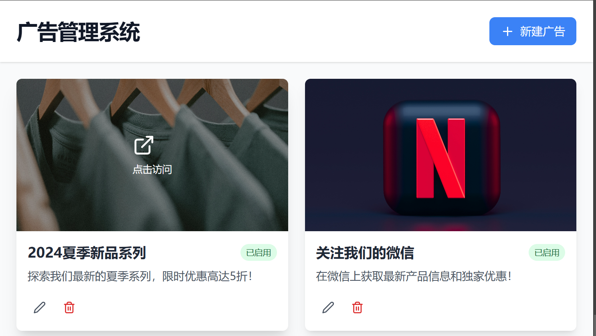

---
# You can also start simply with 'default'
theme: default
title: 全栈开发如何做一个完整的研发云应用
info: |
  ## Slidev Starter Template
  Presentation slides for developers.

  Learn more at [Sli.dev](https://sli.dev)
# apply unocss classes to the current slide
class: text-center
# https://sli.dev/features/drawing
drawings:
  persist: false
transition: slide-left
# enable MDC Syntax: https://sli.dev/features/mdc
mdc: true
---

<h1 class="bg-gradient-to-r from-green-400 to-blue-500 bg-clip-text text-transparent">  
Web 全栈开发
</h1>
<br/>

## 如何做一个完整的研发云应用
 
 
<br/>
<br/>
 

<footer class="text-gray-500 mt-4">  王新海 2024-12-13
</footer>

<!--
> 这个话题很大啊，不可能在这么短的时间讲完，但是呢，我另辟蹊径，简单地从方法论上去讲这个事情。比如说怎么利用现在的那种生产力工具，学习工具，AI工具，包括一些自我发展，自我激发的内容。
-->

---
transition: fade-out
---

# 内容

- 介绍 **全栈开发**
- Web 相关概念介绍, 和相关技术栈
- 利用 AI 学习 
- 了解 AI 编程辅助
- 研发云介绍
- 编码： <b>演示项目广告管理</b>
- 部署实践

<style>
h1 , b {
  background-color: #2B90B6;
  background-image: linear-gradient(45deg, #4EC5D4 10%, #146b8c 20%);
  background-size: 100%;
  -webkit-background-clip: text;
  -moz-background-clip: text;
  -webkit-text-fill-color: transparent;
  -moz-text-fill-color: transparent;
}
</style>

<!--
你们当中的有些人呢，对这个感兴趣，但是有些人呢，是应付差事但是呢，我不希望把这么短时间的把它浪费掉了，我想做个尝试.怎么说呢？在国企长期待, 要面对一个**体制化**的问题，这什么意思呢？个人见解，留在电信大概有两种情况：一种情况是晋升领导或担任业务技术骨干；另一种情况是混（现在叫躺），不要误会我的意思，其实就是以生活为主，工作为辅；第一种情况不用说，能力强，机会好。我说第二种情况，其实，混大多数情况不是主动的， 而是被动的。我参加过招聘，你们的能力在以后工作上会游刃有余，如果岗位不能发挥你的热情，就容易迷茫蹉跎岁月。

我这里只是提供一个经验，就是在工作闲余时间，能够实践一些技术性的东西，也会给自己带来一些乐趣。当然这也是技术专家的一条路径。因为我当初就是这么过来的。
-->

---
transition: fade-out
level: 2
---

# 任务目标

演示项目：**广告管理**

- 前端页面呢，上传图片，做文字描述，适当的增加一些吸睛效果。可在线预览
- 用户点击广告，就会到对应的销售页面，或者微信公众号等
  > 这是另外一批人已经完成的工作

- 后端保存广告效果，和维护一个链接。
# 说明
> - 演示项目是一个复杂系统的一部分, 但是我们**忽略**其他的部分.  
<v-click> 

> - 演示项目是实验性的， 而且侧重点不是编程， 而是了解**开发路径**。   
> - 遇到一些难理解的东西，也不要气馁， 以感性认知为主。
</v-click>

<style>
h1 {
  background-color: #2B90B6;
  background-image: linear-gradient(45deg, #4EC5D4 10%, #146b8c 20%);
  background-size: 100%;
  -webkit-background-clip: text;
  -moz-background-clip: text;
  -webkit-text-fill-color: transparent;
  -moz-text-fill-color: transparent;
}
</style>

<!--
我们今天尽量完成一个演示项目， 通过完成这个项目来串讲今天的课题。
-->

---
transition: fade-out
---


[在线演示](https://bolt.new/~/sb1-ay4t7ur9)

<!--
我们今天尽量完成一个演示项目， 通过完成这个项目来串讲今天的课题。
# 项目演示1分钟
-->

---
transition: fade-out
---

# 什么是Web全栈开发

全栈开发是指一个开发者能够处理应用开发的所有方面。
> 短回答： 什么都懂一点，什么都自己做, 简称全做。


**为什么需要全栈开发？**

*   **少沟通和协作:** 减少团队成员之间的沟通障碍。
*   **更快/慢？的开发速度:**  独立完成更多任务，对其他团队成员的少依赖。
*   **更灵活的发展:**  掌握更多技能，拥有更广阔的选择。
<div v-click>

*   **现实因素:**  适应电信工作节奏 `管理驱动，而不是技术驱动 -- 方向灵活，团队氛围弱`
</div>
<v-click>

**需要注意的是**
1. 全栈开发并不意味着精通所有技术，而是指具备跨领域开发的能力，并能够根据项目选择和运用合适的技术。
</v-click>
<v-click>

2. 全栈开发者可以掌握广泛的技能，但通常也会专注于某些特定领域，并与其他专家进行协作。
</v-click>

<style>
h1 {
  background-color: #2B90B6;
  background-image: linear-gradient(45deg, #4EC5D4 10%, #146b8c 20%);
  background-size: 100%;
  -webkit-background-clip: text;
  -moz-background-clip: text;
  -webkit-text-fill-color: transparent;
  -moz-text-fill-color: transparent;
}
</style>

<!--
开始之前， 我还是先介绍一下基本概念
什么是全栈？简单说，什么都懂一点，把什么都不精，就像是游戏里面分配技能点。
# 补充
管理驱动，也就是听领导指挥，技术完全服从业务，而且要短平快。
# 演示完毕后
现在我们利用工具，特别是AI助手来做一项有趣的事情，我会以现场编码的形式来讲解。

那怎么开始呢？干脆, 把这段内容直接交给Ai 我们试一下

# 任务目标
演示项目：电信行业广告管理
前端页面呢，上传图片，做文字描述/中文，适当的增加一些吸睛效果。可在线预览

用户点击图片的时候呢，就会到对应的销售页面，或者微信公众号等

后端保存广告内容和链接。使用json来模拟持久化
-->

---
transition: slide-up
level: 2
---

# Web全栈包括那些？
<a href="https://www.processon.com/mindmap/66bc0c7da448e8742aaabf93" class="fixed right-0">next</a>


<!--
> 稍后讲解 Web 全栈开发，脑图
-->

---
layout: default
---

# 相关概念

- **前端：** 负责构建用户界面和交互。学习 HTML、CSS 和 JavaScript 是基础，然后可以选择一个框架 (React, Vue, SolidJs) 来提高开发效率。构建工具、状态管理和 UI 组件库可以帮助你构建更复杂的应用。
<v-click>

- **后端：** 负责处理业务逻辑、数据存储和 API 接口。你需要选择一门后端语言 (Node.js, Python, Java, Go 等) 和一个 Web 框架, 选择合适的数据库来存储数据，安全性也是后端开发的重要方面。
</v-click><v-click>

- **部署：** 将应用部署到服务器上，让用户可以访问。现和容器化技术 (Docker, Kubernetes)紧密相关。
</v-click><v-click>

- **容器:**   容器是在物理机上通过轻量虚拟化技术隔离的子系统, 每个子系统有自己的文件系统、网络接口和进程空间, 故称**容器**, 类似于**玻璃杯**。Docker是这种技术的套件. 
</v-click><v-click>

- **Kubernetes**（通常简称为K8s）是一个Google开源的容器**编排**(Compose)平台，即容器技术的**规模化**, **规范化**
</v-click><v-click>

- **云**: **"云是弹性的池化远程IT服务"**
 计算机 - 远程计算机 - 分布式服务器 - 云
  > 类比: 弹性的池化, 如同**火车售票排队系统**;   **反面**: 固定且独立的专用资源, 如**私人秘书.**
  >
  > 伴生概念: 云计算,即云计算机/远程计算机, 因为面向服务, 而不是设备, 所以去掉了**机**
  >
  > 划分: 公有云, 私有云, 混合云
</v-click>

---
layout: default
---
- **翼云** `云计算`服务平台，旨在为企业和个人用户提供**云计算**解决方案。翼云平台集成了多种云服务，包括计算、存储、网络、安全、数据库、大数据、人工智能等，帮助企业快速构建和管理云上应用。**我们的项目最终部署在这里.**

  > 注意干扰选项: 云翼,  天翼云.  
  >
  > - **天翼云**：本司公有云平台**品牌**，最底层提供IaaS（Infrastructure as a Service/一代目）服务。
  > - **翼云**：提供计算、存储、网络、安全等多种云服务(Paas/二代目）和部分IaaS功能
  > - **云翼**：企业级应用开发平台(SaaS/三代目)
<v-click>

- **[研发云平台](https://www.srdcloud.cn/)**是云上**研发协同**平台。具备完整的研发运营一体化（DevOps），能实现**软件规划**到**生产部署**的贯通，为研发团队(含内外)提供**全栈**的研发环境.

  
</v-click>
<v-click>

- **CCES**: 电信版本的Kubernetes

- **其他：** 一些通用的技能和工具，例如版本控制、项目管理、API 文档等。
</v-click>
---
layout: two-cols
layoutClass: gap-16
level: 2
---

# Shiki Magic Move

````md magic-move {lines: true}
```ts {*|2|*}
// step 1
const author = reactive({
  name: 'John Doe',
  books: [
    'Vue 2 - Advanced Guide',
    'Vue 3 - Basic Guide',
    'Vue 4 - The Mystery'
  ]
})
```

```ts {*|1-2|3-4|3-4,8}
// step 2
export default {
  data() {
    return {
      author: {
        name: 'John Doe',
        books: [
          'Vue 2 - Advanced Guide',
          'Vue 3 - Basic Guide',
          'Vue 4 - The Mystery'
        ]
      }
    }
  }
}
```

```ts
// step 3
export default {
  data: () => ({
    author: {
      name: 'John Doe',
      books: [
        'Vue 2 - Advanced Guide',
        'Vue 3 - Basic Guide',
        'Vue 4 - The Mystery'
      ]
    }
  })
}
```

Non-code blocks are ignored.

```vue
<!-- step 4 -->
<script setup>
const author = {
  name: 'John Doe',
  books: [
    'Vue 2 - Advanced Guide',
    'Vue 3 - Basic Guide',
    'Vue 4 - The Mystery'
  ]
}
</script>
```
````

---
theme: default
layout: cover
---

# CSS to Tailwind CSS

使用 Shiki Magic Move

---
layout: two-cols
---

# 传统 CSS

```css {1-10|3-6|5|all}
.button {
  background-color: #4CAF50; /* Green */
  color: white;
  padding: 16px 32px;
  margin: 8px;
  cursor: pointer;
}
```

::right::

Tailwind CSS
```html {all}
<button 
class="bg-green-500 text-white py-4 px-8 m-2">
  Click me
</button>
```

## 转换步骤
```
背景颜色: background-color: #4CAF50; -> bg-green-500
文本颜色: color: white; -> text-white
内边距: padding: 16px 32px; -> py-4 px-8
外边距: margin: 8px; -> m-2
```

## 优势
>- 可维护性: Tailwind 使用实用类，更容易维护和重用。
>- 一致性: Tailwind 提供了预定义的样式系统，确保设计一致
>- 性能: Tailwind 删除未使用的样式，减小文件大小，提高性能。

---
layout: iframe
url: https://search.bilibili.com/all?keyword=web%20%E5%85%A8%E6%A0%88%E5%BC%80%E5%8F%91&from_source=webtop_search&spm_id_from=333.1073&search_source=5
---

# 3. 响应式设计
---
layout: end
---
# 谢谢
时间匆忙，如有错误之处，请多包涵。
